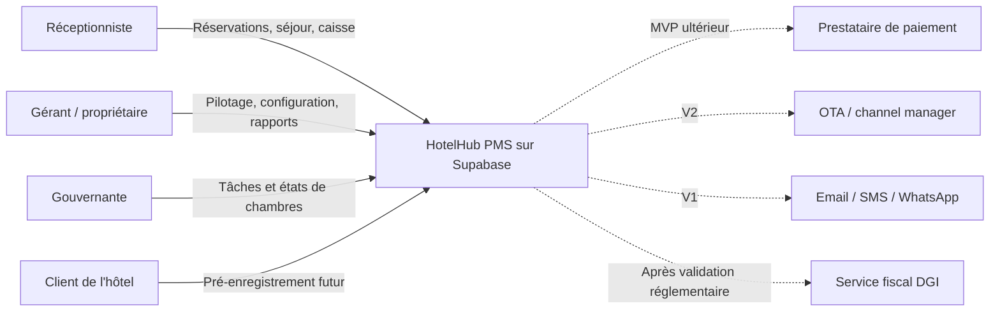
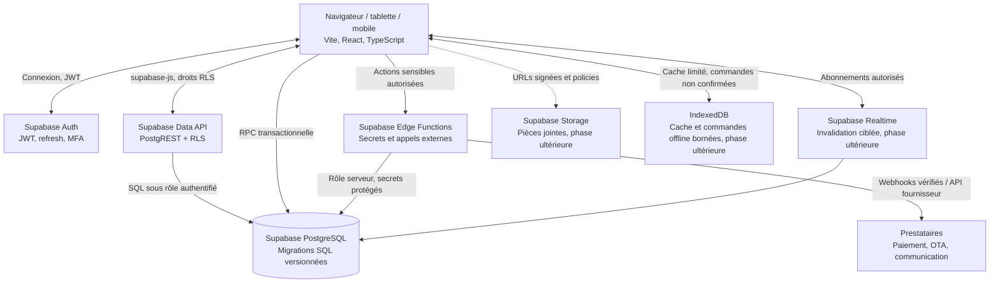

# Architecture cible PMS

Version de cadrage : 0.2  
Périmètre : MVP pilote pour un hôtel indépendant de 10 à 80 chambres, extensible à plusieurs hôtels par tenant.  
Statut : proposition Supabase-first, non encore implémentée.

## Décision de stack

Le dépôt existant est une application Vite/React connectée à Supabase. Pour éviter une migration de framework et deux systèmes concurrents de migrations/types, le MVP conserve cette base : React/Vite, Supabase Auth, PostgreSQL managé, migrations SQL et `supabase-js`. Il n’ajoute ni Prisma, ni NestJS, ni Redis/BullMQ.

Cette décision s’écarte explicitement du prompt master qui propose Next.js et un serveur NestJS/Fastify avec Prisma/Drizzle. Une évolution vers ces composants devra répondre à un besoin mesuré et être décidée séparément ; le présent dépôt garde une seule source de vérité pour le schéma : `supabase/migrations`.

## Objectifs et limites du MVP

Le MVP couvre l’administration d’un hôtel, les utilisateurs et rôles, les chambres, les clients, les réservations, le séjour, le folio, les paiements enregistrés par un agent, la caisse, le housekeeping, la maintenance et l’audit.

Les OTA, paiements Mobile Money automatisés, facturation DGI, F&B, RH, revenue management, WhatsApp/SMS et déploiement Kubernetes restent des intégrations ou modules ultérieurs. Le paiement manuel par Orange Money, Wave, MTN ou Moov peut être enregistré comme mode de paiement, mais ne vaut pas rapprochement opérateur.

## C4 — Contexte

## C4 — Conteneurs

## Responsabilités

- **Web** : l’application Vite/React utilise `supabase-js`. Les opérations simples de lecture/CRUD restent protégées par RLS. Les requêtes ne doivent jamais utiliser la clé `service_role` dans le navigateur.
- **PostgreSQL** : source de vérité et propriétaire des contraintes métier. Les évolutions passent par des migrations SQL Supabase ; les types TypeScript peuvent être générés depuis le schéma, sans modèle ORM concurrent.
- **RPC PostgreSQL** : opérations qui doivent être atomiques, notamment création d’une réservation, attribution d’une chambre, check-in/out, encaissement et clôture de caisse. Chaque RPC valide l’utilisateur, le tenant, l’hôtel, le rôle et les invariants dans une transaction.
- **Edge Functions** : orchestration nécessitant des secrets, webhooks, appels vers les prestataires et traitements serveur. Une Edge Function n’est pas un contournement des permissions ; elle vérifie le JWT et délègue au rôle SQL le moins privilégié possible.
- **Realtime** : facultatif pour les vues réellement collaboratives. Les canaux et lignes diffusés restent limités par les politiques d’accès ; le rafraîchissement manuel est acceptable dans le premier MVP.
- **Tâches différées** : commencer avec l’outbox en base et un traitement planifié adapté aux besoins Supabase. N’ajouter une file dédiée qu’après avoir établi le volume, la politique de retry et le besoin de dead-letter.
- **Stockage** : Supabase Storage avec buckets privés et URLs signées lorsque photos ou pièces jointes entrent dans le périmètre.

## Décisions et invariants métier

1. **Monolithe modulaire** : un seul déploiement API au début, modules séparés par domaine. Pas de microservices avant un besoin de charge ou d’équipe démontré.
2. **Tenant issu de l’identité Supabase et vérifié en base** : un `tenantId` envoyé par le navigateur n’est jamais une preuve d’accès. RLS, RPC et Edge Functions vérifient la membership et l’accès à l’hôtel ciblé.
3. **Isolation défense en profondeur** : RLS testée sur chaque table exposée, contraintes SQL pour la cohérence tenant/hôtel et permissions SQL minimales. Les fonctions `SECURITY DEFINER` fixent un `search_path` sûr, valident `auth.uid()` et n’acceptent jamais un rôle arbitraire du client.
4. **Réservation sans double vente** : une chambre physique est réservée avec l’intervalle semi-ouvert `[checkIn, checkOut)`. Une contrainte d’exclusion PostgreSQL rejette atomiquement tout chevauchement actif. Le statut de housekeeping n’est pas utilisé comme calcul de disponibilité.
5. **Argent** : XOF est stocké en unités entières `BigInt`; taux de taxe et de service stockés en points de base. Les montants et lignes de folio sont immuables après validation ; une correction passe par une contre-écriture.
6. **Écritures cohérentes** : réservation, attribution de chambre, folio initial et événement outbox sont enregistrés dans une transaction. Check-in/out et paiement suivent le même principe.
7. **Audit** : chaque mutation sensible enregistre acteur, tenant, hôtel, action, cible, date et identifiant de corrélation. L’append-only est imposé dans les migrations et testé.
8. **Offline borné** : IndexedDB stocke un instantané limité et des commandes idempotentes. Une réservation hors ligne est provisoire jusqu’à acceptation serveur ; les conflits de chambre sont présentés à l’utilisateur, jamais résolus silencieusement.
9. **Conformité** : aucune conformité DGI/ARTCI n’est revendiquée avant validation des règles et tests avec les organismes ou prestataires compétents.

## Authentification et autorisation

- Supabase Auth gère les mots de passe, sessions, JWT et refresh tokens ; ne pas réimplémenter leur stockage dans une table applicative.
- MFA TOTP Supabase à activer pour `OWNER` et `ADMIN` avant exposition à des données de production.
- Rôles MVP : `OWNER`, `ADMIN`, `MANAGER`, `RECEPTIONIST`, `HOUSEKEEPER`, `ACCOUNTANT`, `MAINTENANCE`, `READONLY`.
- Les permissions sont vérifiées par action et par périmètre (`tenantId`, `hotelId`). Être membre du tenant ne donne pas automatiquement le droit de modifier les rôles, supprimer des données ou clôturer toute caisse.
- Invitations et création de membership passent par un flux contrôlé. Aucun client ne peut s’ajouter à un tenant existant ni choisir son rôle.
- Un trigger SQL transactionnel sur `auth.users` crée le tenant, le membership `owner` et l’hôtel lors du signup. Il lit `hotel_name` des métadonnées non fiables uniquement comme nom, le valide, utilise `NEW.id` comme identité et fixe lui-même le rôle `owner`.

## Développement et exploitation

Le développement local utilise la Supabase CLI (`supabase start`, `supabase db reset`), migrations versionnées et données de démonstration non sensibles. Les clés locales et variables `VITE_SUPABASE_*` sont documentées dans un `.env.example` sans secret réel. Les environnements utilisent des clés distinctes, sauvegardes restaurables et secrets Edge Function hors dépôt. L’hébergement et la résidence des données seront décidés après vérification des contraintes légales et de la latence réelle depuis la Côte d’Ivoire.
