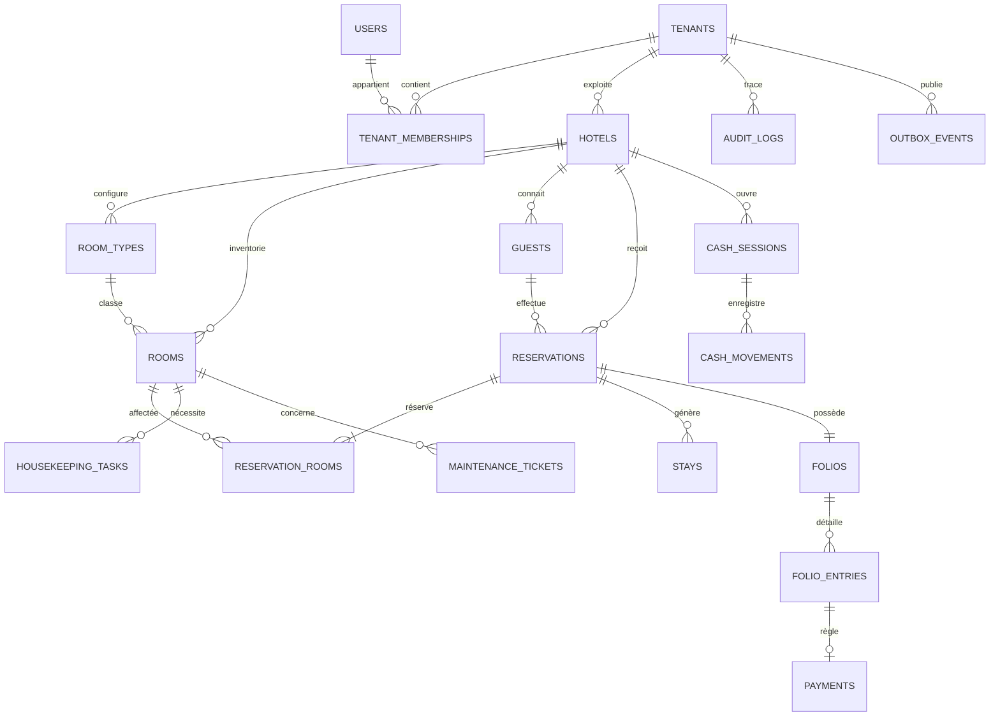

# Modèle de données Supabase

Version de cadrage : 0.2  
La source de vérité est PostgreSQL via les migrations `supabase/migrations`. Ce document décrit le modèle MVP et les extensions à livrer par migrations ; il ne crée pas une seconde définition ORM.

## Schéma actuellement présent

Les migrations existantes créent les tables suivantes :

- `tenants`, `tenant_memberships`, `hotels`
- `room_types`, `rooms`
- `guests`, `reservations`, `folio_lines`
- `housekeeping_tasks`, `cash_sessions`
- `maintenance_tickets`

Le schéma existant contient déjà des colonnes `tenant_id` et des policies RLS sur les tables métier. Il doit toutefois être durci avant toute utilisation avec des données réelles : l’auto-inscription aux memberships, l’élévation de rôle, les politiques récursives et l’absence de contraintes composite tenant/hôtel sont des sujets prioritaires identifiés lors de l’audit.

## Modèle relationnel MVP visé

`USERS` représente les identités gérées par Supabase Auth (`auth.users`) ; la migration ne doit pas recopier les mots de passe ou jetons dans une table applicative.

## Extensions nécessaires au parcours MVP

Les tables existantes couvrent une première démonstration, mais un PMS fiable doit séparer les concepts suivants dans des migrations additionnelles :

- `reservation_rooms` : une réservation peut affecter une ou plusieurs chambres, avec dates, tarif convenu et indicateur `inventory_held`.
- `stays` : check-in/out par chambre et par client, horodatage et utilisateur opérateur.
- `folios` et `folio_entries` : charges, paiements, remboursements et ajustements immuables, avec devise et montants entiers XOF.
- `payments` : statut, méthode, clé d’idempotence et référence opérateur ; les paiements externes restent `pending` jusqu’à confirmation vérifiée.
- `cash_movements` : entrées/sorties et lien éventuel au paiement ; les sessions ne sont pas calculées à partir de tous les paiements de l’hôtel.
- `audit_logs` : acteur, tenant, hôtel, action, cible, identifiant de requête et métadonnées expurgées ; pas de mise à jour/suppression par les rôles applicatifs.
- `outbox_events` : événements métier écrits dans la même transaction que les mutations à notifier ou synchroniser.
- `guest_consents` : consentement par finalité, source et retrait, avant activation des communications marketing.
- `buildings` et `floors` : uniquement lorsque la gestion par bâtiment/niveau est nécessaire.

Les rôles applicatifs sont des données d’autorisation, pas des claims que le client peut choisir. La liste cible comprend `owner`, `admin`, `manager`, `receptionist`, `housekeeper`, `accountant`, `maintenance` et `readonly`.

## Contraintes SQL et sécurité à prévoir

1. Toutes les tables métier portent `tenant_id`; les tables liées à un hôtel portent aussi `hotel_id`.
2. Ajouter des clés étrangères composites `(tenant_id, hotel_id)` vers les hôtels et relations composites adaptées afin qu’une ligne ne puisse associer l’hôtel d’un autre tenant.
3. Vérifier `check_out > check_in`, montants non négatifs, unicité du numéro de chambre par hôtel et unicité du numéro de réservation par tenant.
4. Activer RLS sur toute table exposée par l’API Supabase. Les policies d’appartenance utilisent un helper SQL `SECURITY DEFINER` étroitement borné, `search_path` fixé et identité provenant de `auth.uid()` pour éviter les policies récursives.
5. Interdire au client de créer ou modifier ses propres memberships/rôles. Le flux d’onboarding attribue `owner` uniquement dans une opération transactionnelle contrôlée.
6. Installer `btree_gist` et ajouter une contrainte d’exclusion sur `(room_id, daterange(check_in, check_out, '[)'))` pour les lignes `inventory_held = true`. L’annulation/no-show libère l’inventaire dans la même transaction.
7. Utiliser les RPC pour réservation, check-in/out, paiement et clôture caisse. Écrire les lignes métier, audit et outbox atomiquement.
8. Conserver les données financières et d’audit ; préférer `deleted_at` à la suppression physique et utiliser `RESTRICT` sur les références importantes.

## Montants et conventions

- XOF est stocké en entier (par exemple `amount_minor bigint`) ; pas de `float` pour les calculs financiers.
- Taux de taxe et service stockés en points de base afin d’éviter les flottants ; chaque calcul conserve le détail des règles appliquées à la réservation.
- Toute ligne de folio validée est immuable. Correction et remboursement sont des écritures compensatoires liées à l’original.
- Horodatages en `timestamptz`; dates de séjour en `date`; fuseau de l’établissement défini séparément (par défaut `Africa/Abidjan`).
- La monnaie, la TVA, les taxes de séjour et la facture normalisée doivent être validées pour chaque juridiction avant certification de conformité.
