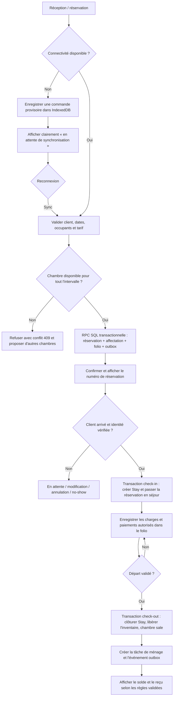
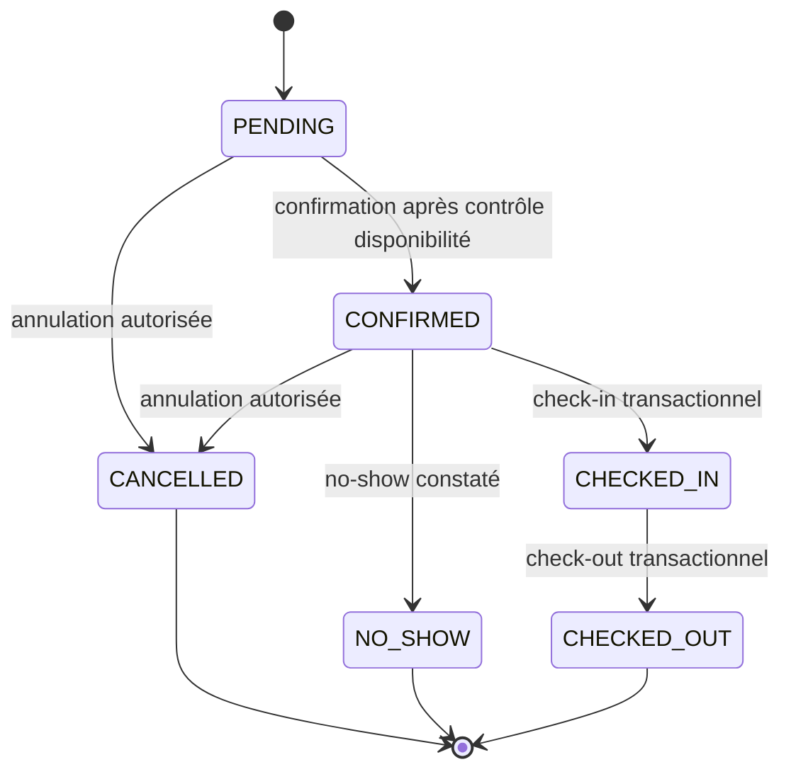

# Workflows PMS — réservation, check-in et check-out

Version de cadrage : 0.1  
Les transitions sensibles sont exécutées par des fonctions SQL RPC transactionnelles, appelées avec le JWT Supabase de l’utilisateur. Les Edge Functions sont réservées aux secrets, webhooks et appels externes. RLS et les fonctions vérifient le rôle et le périmètre hôtel/tenant.

## Parcours nominal

## Réservation

1. L’agent choisit l’hôtel courant ; la base vérifie la membership et les permissions via le JWT Supabase et RLS.
2. La RPC valide les dates (`checkOut > checkIn`), les occupants, le client, le tarif, la devise et l’état opérationnel de la chambre.
3. La disponibilité est verrouillée dans une transaction. Une contrainte d’exclusion PostgreSQL sur les affectations actives reste l’arbitre final en cas de requêtes concurrentes.
4. La RPC écrit réservation, chambres, folio initial, audit et `reservation.created` dans l’outbox au sein d’une transaction.
5. Si la contrainte échoue, Postgres annule toute la transaction ; le client reçoit une erreur métier sans réservation partielle ni charge orpheline.
6. Une Edge Function ou tâche planifiée consomme l’outbox après commit. L’échec d’une notification n’annule pas la réservation et reste visible pour retry.

## Check-in

1. Un réceptionniste ou manager retrouve la réservation par numéro, nom ou recherche autorisée.
2. La RPC vérifie l’état `CONFIRMED`, la fenêtre d’arrivée, l’identité requise et que la chambre n’est pas hors service/bloquée.
3. Dans une transaction, elle verrouille les lignes concernées, crée le ou les séjours, passe la réservation à `CHECKED_IN`, écrit l’audit et l’événement `stay.checked_in`.
4. Le solde ou dépôt est contrôlé selon la politique de l’hôtel. Une dérogation est explicitement autorisée et auditée, jamais implicite.
5. Si la transaction échoue, aucun statut partiel n’est affiché comme validé.

## Paiement et folio

1. Chaque encaissement passe par une RPC avec clé d’idempotence, montant positif, devise, méthode, auteur et référence prestataire éventuelle.
2. Pour un paiement externe, le statut commence `PENDING`; seule une confirmation vérifiée permet l’écriture définitive au folio. Les appels navigateur ne déclarent jamais eux-mêmes une transaction Mobile Money réussie.
3. Pour une réception manuelle, l’agent autorisé enregistre l’encaissement et le mode ; l’écriture paiement, la ligne de folio et le mouvement de caisse correspondant sont atomiques.
4. Une correction ou un remboursement ajoute une contre-écriture liée à l’original. Les lignes validées ne sont pas modifiées ni supprimées.

## Check-out

1. L’agent consulte le folio complet, ajoute les extras vérifiés et voit le solde recalculé côté serveur.
2. Le check-out peut être refusé si le solde dépasse la limite configurée, ou autorisé avec une dérogation auditée.
3. Dans une transaction, l’API clôt le séjour, passe la réservation à `CHECKED_OUT`, libère l’inventaire à la date de départ, place la chambre en état opérationnel `DIRTY`, crée une tâche `CHECKOUT_CLEAN`, écrit l’audit et `stay.checked_out`.
4. L’émission d’une facture officielle n’est activée qu’après implémentation et validation de l’intégration fiscale applicable.

## États autorisés

Les transitions ne sont pas des mises à jour libres de statut : l’API vérifie l’état précédent, le rôle, les conditions métier et enregistre l’audit. Une réservation annulée ou no-show libère son inventaire dans la même transaction.

## Comportement hors ligne

- Les listes et informations nécessaires à la réception peuvent être mises en cache localement avec une durée et une portée limitées.
- Chaque commande hors ligne porte un UUID d’idempotence, l’utilisateur, l’hôtel, l’heure locale et la version de l’instantané utilisé.
- Le check-in ou paiement manuel peut être mis en attente locale, mais n’est pas présenté comme synchronisé avant confirmation serveur. Un encaissement offline porte l’état « à rapprocher ».
- La synchronisation rejoue les commandes une par une. Conflit de disponibilité, permission révoquée ou version obsolète : l’action est isolée et présentée à l’agent ; pas de résolution automatique qui vendrait deux fois une chambre.
- Les secrets, jetons de refresh et données de carte ne sont jamais stockés dans IndexedDB.
